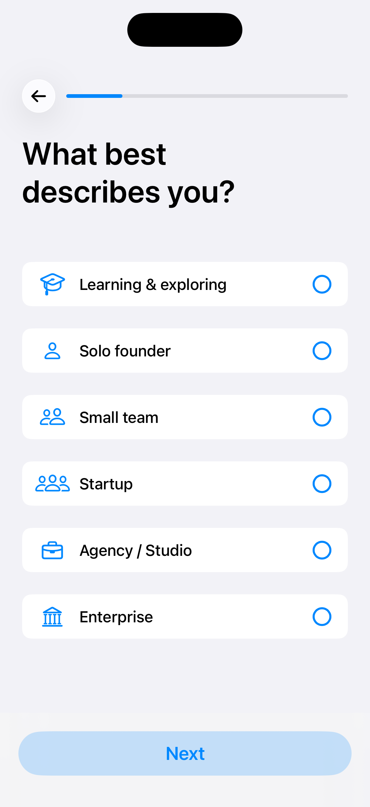
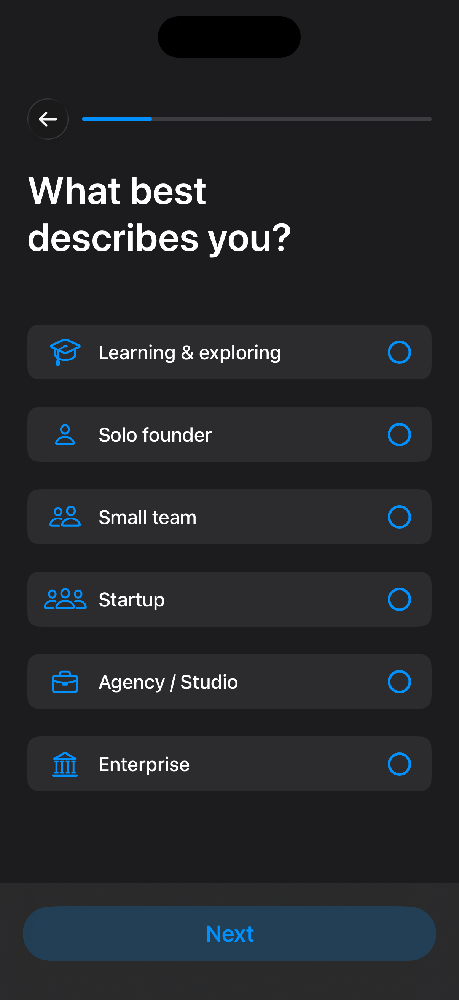
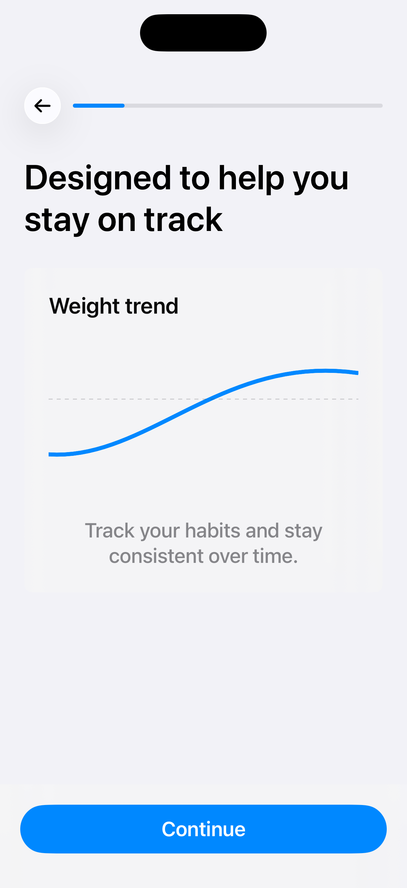

# SwiftUI-Surveys

A Swift package that provides an elegant and customizable survey interface for iOS applications using SwiftUI. <br>
SwiftUI-Surveys makes it easy to create professional-looking surveys with a modern design and smooth user experience.

<p align="center">
  
  
  
</p>

## Features

- 📊 Native progress indicator for survey progress
- 🧭 Mix questions with non-question content steps
- ✅ Support for single and multiple choice questions
- 🔄 Seamless navigation between questions with back/next functionality
- ✨ Automatic answer validation
- 🎯 Completion handling
- 🎨 Clean and modern UI with smooth animations
- 🌍 Full localization support with LocalizedStringKey
- 📱 Fully SwiftUI native

## Requirements

- iOS 17.0+
- Swift 6+
- Xcode 16.0+

## Installation

### Swift Package Manager

Add SwiftUI-Surveys to your project through Xcode:

1. File > Add Packages
2. Enter package URL: ```https://github.com/Sedlacek-Solutions/SwiftUI-Surveys.git```
3. Select version requirements
4. Click Add Package

## Usage

### Creating Survey Questions

```swift
let questions = [
    SurveyQuestion(
        titleKey: "How would you describe your experience?",
        answers: [
            .init(titleKey: "Beginner"),
            .init(titleKey: "Intermediate"),
            .init(titleKey: "Advanced")
        ],
        isMultipleChoice: false
    ),
    SurveyQuestion(
        titleKey: "What features interest you?",
        answers: [
            .init(titleKey: "Analytics"),
            .init(titleKey: "Reporting"),
            .init(titleKey: "Sharing"),
            .init(titleKey: "Export")
        ],
        isMultipleChoice: true
    )
]
```

### Using System Images

Answers can include an optional SF Symbol to show alongside the label:

```swift
let questions = [
    SurveyQuestion(
        titleKey: "How would you describe your experience?",
        answers: [
            .init(titleKey: "Beginner", systemImage: "figure.walk"),
            .init(titleKey: "Intermediate", systemImage: "figure.hiking"),
            .init(titleKey: "Advanced", systemImage: "figure.run")
        ]
    ),
    SurveyQuestion(
        titleKey: "What features interest you?",
        answers: [
            .init(titleKey: "Analytics", systemImage: "chart.bar"),
            .init(titleKey: "Reporting", systemImage: "doc.text.magnifyingglass"),
            .init(titleKey: "Sharing", systemImage: "square.and.arrow.up"),
            .init(titleKey: "Export", systemImage: "arrow.down.doc")
        ],
        isMultipleChoice: true
    )
]
```

### Localization Support

SwiftUI-Surveys supports localization using `LocalizedStringKey`. You can provide localized strings for both questions and answers:

```swift
let questions = [
    SurveyQuestion(
        titleKey: "survey.question.experience",
        answers: [
            .init(titleKey: "survey.answer.beginner", systemImage: "figure.walk"),
            .init(titleKey: "survey.answer.intermediate", systemImage: "figure.hiking"),
            .init(titleKey: "survey.answer.advanced", systemImage: "figure.run")
        ]
    )
]
```

Add your localized strings to your `Localizable.strings` file:

```
// English (en)
"survey.question.experience" = "How would you describe your experience?";
"survey.answer.beginner" = "Beginner";
"survey.answer.intermediate" = "Intermediate";
"survey.answer.advanced" = "Advanced";

// Spanish (es)
"survey.question.experience" = "¿Cómo describirías tu experiencia?";
"survey.answer.beginner" = "Principiante";
"survey.answer.intermediate" = "Intermedio";
"survey.answer.advanced" = "Avanzado";
```

### Included Localizations

The package ships translations for the built-in UI strings (Back, Continue, Next, Other, Select all that apply) in these locales:

- English (en)
- Spanish (es)
- French (fr)
- German (de)
- Italian (it)
- Portuguese (Brazil) (pt-BR)
- Japanese (ja)
- Korean (ko)
- Chinese (Simplified) (zh-Hans)
- Chinese (Traditional) (zh-Hant)

When using the provided `LocalizedStringKey` helpers (for example `.back`, `.next`), use `Text(..., bundle: .module)` so the keys resolve from the package bundle.

### Custom Accent Color

Use `surveyAccentColor(_:)` to theme the built-in survey controls:

```swift
SurveyFlow(questions: questions)
    .surveyAccentColor(.purple)
```

The modifier updates the built-in blue survey UI, including answer icons, selected borders, checkmarks, progress, content-step symbols, and the primary action button. Semantic colors, such as success states, keep their original meaning.

### Adding Custom Content Steps

Use `SurveyFlowStep` when your flow needs screens that are not questions, such as onboarding, education, charts, product previews, or any other custom SwiftUI content:

```swift
let steps: [SurveyFlowStep] = [
    .custom {
        VStack(spacing: 24) {
            Text("Designed to help you stay on track")
                .font(.largeTitle.weight(.semibold))
                .frame(maxWidth: .infinity, alignment: .leading)

            CustomChartView()

            Text("Track your habits and stay consistent over time.")
                .font(.title3)
                .foregroundStyle(.secondary)
                .multilineTextAlignment(.center)
        }
    },
    .question(
        .init(
            titleKey: "What best describes your goal?",
            answers: [
                .init(titleKey: "Build consistency", systemImage: "calendar"),
                .init(titleKey: "Understand trends", systemImage: "chart.xyaxis.line"),
                .init(titleKey: "Stay accountable", systemImage: "checkmark.circle")
            ]
        )
    ),
    .custom(isScrollable: false) {
        CustomFullScreenSummaryView()
    }
]

SurveyFlow(
    flowSteps: steps,
    onFlowStepContinue: { step in
        // Track every submitted step, including custom content screens
        print("Continued from step: \(step.id)")
        print("Step type: \(step.stepType)")
    },
    onAnswer: { question, answers in
        // Called only for question steps
        print("Question: \(question.title)")
        print("Selected answers: \(answers)")
    },
    onCompletion: { allAnswers in
        // Contains only question answers, not content steps
        processSurveyResults(allAnswers)
    }
)
```

Use `flowSteps:` for runtime-only custom SwiftUI screens. Use `steps:` for Codable `SurveyStep` arrays that can be loaded from JSON.

By default, `.custom` wraps your content in the same scroll container as other content screens. Pass `isScrollable: false` when your custom view owns its own scrolling or fixed layout.

### Branching Between Steps

Flows advance linearly by default. Pass `nextStep` when the next screen should depend on the submitted step or the answers collected so far:

```swift
let quickAnswer = SurveyAnswer(id: "quick", titleKey: "Keep it short")
let detailedAnswer = SurveyAnswer(id: "detailed", titleKey: "Show me more")
let setupQuestion = SurveyQuestion(
    id: "setup-depth",
    titleKey: "How much setup guidance do you want?",
    answers: [quickAnswer, detailedAnswer]
)

let steps: [SurveyFlowStep] = [
    .question(setupQuestion),
    .custom(id: "details") {
        DetailedSetupView()
    },
    .custom(id: "summary") {
        SummaryView()
    }
]

SurveyFlow(
    flowSteps: steps,
    nextStep: { step, answers in
        guard step.question?.id == setupQuestion.id else {
            return .next
        }

        if answers[setupQuestion, default: []].contains(quickAnswer) {
            return .step(id: "summary")
        }

        return .next
    },
    onCompletion: { allAnswers in
        processSurveyResults(allAnswers)
    }
)
```

`nextStep` returns `SurveyFlowNavigation.next`, `.step(id:)`, or `.complete`. Back navigation follows the user's actual path, so if a branch skips a screen, Back returns to the previous visited screen. Completion results include answers from the completed path, so answers from abandoned branches are not returned.

Custom content steps are runtime-only because SwiftUI views cannot be encoded to JSON. Use `SurveyStep` and `SurveyContentStep` when you need Codable, runtime-loaded survey definitions:

```swift
let codableSteps: [SurveyStep] = [
    .content(
        .init(
            titleKey: "Welcome",
            bodyKey: "This screen can be loaded from JSON.",
            media: .systemImage("sparkles")
        )
    ),
    .question(
        .init(
            titleKey: "How would you describe your experience?",
            answers: [
                .init(titleKey: "Beginner"),
                .init(titleKey: "Intermediate"),
                .init(titleKey: "Advanced")
            ]
        )
    )
]
```

### JSON Support

`SurveyStep`, `SurveyContentStep`, `SurveyContentMedia`, `SurveyQuestion`, and `SurveyAnswer` conform to `Codable`, so you can serialize data-driven surveys to JSON and load them back at runtime:

```swift
import Surveys

let steps: [SurveyStep] = [
    .content(.init(titleKey: "Welcome")),
    .question(
        .init(
            titleKey: "How would you describe your experience?",
            answers: [
                .init(titleKey: "Beginner"),
                .init(titleKey: "Intermediate"),
                .init(titleKey: "Advanced")
            ]
        )
    )
]

let encoder = JSONEncoder()
encoder.outputFormatting = [.prettyPrinted, .sortedKeys]
let data = try encoder.encode(steps)

let decoder = JSONDecoder()
let decoded = try decoder.decode([SurveyStep].self, from: data)
```

### Basic Implementation

```swift
import Surveys
import SwiftUI

struct ContentView: View {
    let questions: [SurveyQuestion] = .mock()

    var body: some View {
        SurveyFlow(
            questions: questions,
            onAnswer: { question, answers in
                // Handle each question's answers immediately when user submits
                print("Question: \(question.title)")
                print("Selected answers: \(answers)")
                
                // Access answer titles
                for answer in answers {
                    print("Answer: \(answer.title)")
                }
            },
            onCompletion: { allAnswers in
                // Handle survey completion with all questions and answers
                print("Survey completed!")
                print("Total questions answered: \(allAnswers.count)")
                
                // Process all answers together
                for (question, answers) in allAnswers {
                    print("Question: \(question.title)")
                    print("Answers: \(answers.map { $0.title })")
                }
                
                // Example: Serialize to JSON and upload
                // let jsonData = encodeToJSON(allAnswers)
                // uploadSurveyResults(jsonData)
            }
        )
    }
}
```

### Handling Only Final Results

If you don't need to process answers individually as they're submitted, you can omit the `onAnswer` parameter and only handle the final results:

```swift
struct ContentView: View {
    let questions: [SurveyQuestion] = .mock()

    var body: some View {
        SurveyFlow(questions: questions, onCompletion: { allAnswers in
            // Handle all answers at once when survey is complete
            processSurveyResults(allAnswers)
        })
    }
    
    func processSurveyResults(_ answers: [SurveyQuestion: Set<SurveyAnswer>]) {
        // Process or serialize all answers together
        print("Survey completed with \(answers.count) questions answered")
    }
}
```

### Handling Back From The First Question

Use `onBack` when the first question's Back button should dismiss the survey or return to a previous app screen:

```swift
SurveyFlow(
    questions: questions,
    onBack: {
        dismiss()
    },
    onCompletion: { allAnswers in
        processSurveyResults(allAnswers)
    }
)
```

### Skip Button Example

```swift
import Surveys
import SwiftUI

@MainActor
struct ContentScreen {
    private func skipAction() {
        // TODO: skip the survey
    }
}

extension ContentScreen: View {
    var body: some View {
        NavigationStack {
            SurveyFlow(questions: .mock())
                .toolbar(content: toolbarContent)
        }
    }

    @ToolbarContentBuilder
    private func toolbarContent() -> some ToolbarContent {
        ToolbarItem(
            placement: .confirmationAction,
            content: skipButton
        )
    }

    private func skipButton() -> some View {
        Button(action: skipAction) {
            Text(.skip, bundle: .module)
        }
    }
}

@MainActor
extension LocalizedStringKey {
    static let skip = LocalizedStringKey("Skip")
}

#Preview {
    ContentScreen()
}
```
